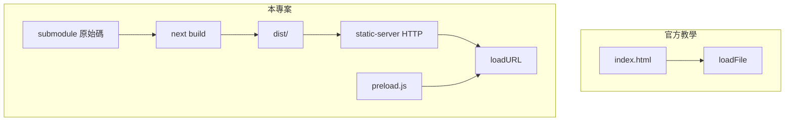

> [!WARNING]
> 本文是AI生成，是在功能製作過程中時順便備份內容當作為來手動處理時參考用。

## 整體改動總覽

本專案是在 [Electron 官方「建立第一個應用程式」](https://www.electronjs.org/zh/docs/latest/tutorial/tutorial-first-app) 的骨架上，把 **既有 Next.js 網站（git submodule）** 包成桌面程式，而不是在根目錄放一個 `index.html`。

### 專案結構（相對官方教學）

| 官方教學 | 本專案 |
|----------|--------|
| 根目錄 `index.html` + `main.js` | `main.js` + `preload.js` + `static-server.js` |
| `win.loadFile('index.html')` | `win.loadURL('http://127.0.0.1:…/')`（本機靜態伺服器） |
| 單一 npm 專案 | **雙層**：Electron 殼 + `aistudio-elrc-maker/`（submodule） |
| 僅 `electron` devDep | 另加 `electron-builder`、`electronmon`、`chokidar-cli`、`concurrently`、`cross-env` |

### Electron 殼（`electron-elrc-maker`）新增／修改

| 檔案 | 作用 |
|------|------|
| `main.js` | 主行程：開視窗、啟動靜態伺服器、IPC 全螢幕、生命週期 |
| `preload.js` | 透過 `contextBridge` 暴露 `window.electronAPI` |
| `static-server.js` | 在 `127.0.0.1` 提供 `aistudio-elrc-maker/dist`（因 Next 靜態匯出用 `/` 絕對路徑） |
| `package.json` | 腳本、`electron-builder` 設定、`electronmon` 監聽規則 |
| `.gitmodules` | 指向 `aistudio-elrc-maker` |
| `README.md` | 使用與疑難排解說明 |
| `.gitignore` | `release/`、`.npm-cache/` 等 |

已刪除官方範例用的根目錄 `index.html`（改由 submodule 建置產物載入）。

### 前端 submodule（需在 AI Studio 手動同步）

| 檔案 | 改動 |
|------|------|
| `components/WebSystemIntegration.tsx` | 偵測 `electronAPI`，全螢幕改走 Electron 原生 API |
| `.gitignore`（建議） | 加上 `out/`、`dist/` |
| `dist/` | `npm run build` 產物，**不提交** |

`next-env.d.ts`、`package-lock.json` 的本機差異**不必**當成 Electron 整合的一部分同步。

---

## 與官方教學相同的部分

對照 [官方教學](https://www.electronjs.org/zh/docs/latest/tutorial/tutorial-first-app)：

- `package.json` 的 `main` 指向 `main.js`
- `electron` 放在 **devDependencies**
- `npm start` → `electron .`（本專案外加 `cross-env` 清環境變數）
- `app.whenReady()` 後才建立視窗
- `window-all-closed`：非 macOS 時 `app.quit()`
- `activate`：macOS 無視窗時再開一個

這些與官方「完整實作」的生命週期邏輯一致。

---

## 官方沒提到、但本專案多做的步驟

### 1. Git submodule 整合

```bash
git submodule update --init --recursive
```

前端不在 Electron repo 裡直接開發，而是子模組；`postinstall` 會對 submodule 跑 `npm install`。

### 2. 先建置 Next.js 靜態站

```bash
npm run build:web   # → aistudio-elrc-maker/dist/
```

官方是直接 `loadFile` 一個 HTML；這裡要先 `next build`（`output: 'export'`），再把 `out` 改名為 `dist`。

### 3. 本機 HTTP 靜態伺服器（`static-server.js`）

**原因：** Next 匯出的 `index.html` 使用 `/_next/static/...` 這類**根路徑**；用 `file://` 開啟會載不到資源。  
**做法：** 主行程在 `127.0.0.1` 起一個只服務 `dist/` 的 HTTP server，再用 `loadURL` 載入。

官方教學只示範 `loadFile`，未涵蓋 SPA／Next 靜態匯出情境。

### 4. Preload + 安全設定（教學在下一章「預載腳本」才細講）

```javascript
webPreferences: {
  preload: path.join(__dirname, 'preload.js'),
  contextIsolation: true,
  nodeIntegration: false,
  sandbox: true,
}
```

- `preload.js`：`electronAPI.toggleFullscreen()` → `ipcMain`
- 與官方第一課的簡單 `loadFile` 相比，已採較完整的現代安全預設

### 5. 開發流程（`npm run dev`）

官方：`electron .` 載入固定 HTML。

本專案：

1. `build:web` 建靜態檔（與打包後行為一致）
2. `chokidar` 監聽前端原始碼 → 自動 `build:web`
3. `electronmon .` 監聽 `dist/` 與主行程檔 → 重啟 Electron

`electronmon` **沒有** `-w` 參數（誤用會把 `dist` 當成 app 入口）；監聽路徑寫在 `package.json` 的 `electronmon.patterns`。

### 6. 打包（`electron-builder`）

官方「打包」在後續章節；本專案已配置：

- `npm run pack` / `npm run dist`
- 產物：`release/`（AppImage、deb、nsis、dmg）
- `files` 只打包 `dist/**` 與 Electron 殼檔案，不含 submodule 原始碼

### 7. `electron-builder` 中繼資料（Linux deb 必填）

- `homepage`
- `author.email`
- `linux.maintainer`

官方第一課的 `package.json` 範例較簡略，打包 deb 時會失敗，需自行補齊。

### 8. 環境變數 `ELECTRON_RUN_AS_NODE`

部分 IDE／CI 會設 `ELECTRON_RUN_AS_NODE=1`，導致 `require('electron')` 拿不到 `app`（`whenReady` 報錯）。  
腳本用 `cross-env ELECTRON_RUN_AS_NODE=` 清除；官方教學未提及。

### 9. 其他主行程行為

| 項目 | 說明 |
|------|------|
| `show: false` + `ready-to-show` | 避免白屏閃爍 |
| `setWindowOpenHandler` | 外部連結用系統瀏覽器開啟 |
| `autoHideMenuBar` | 隱藏選單列 |
| 視窗尺寸 | 1280×800（非教學的 800×600） |
| `will-quit` | 關閉靜態 HTTP server |

---

## 需要注意的事項（官方第一課未寫）

1. **不要改 submodule 來配合 Electron**（除 AI Studio 那邊要合併的 `WebSystemIntegration.tsx` 與 `.gitignore`）。
2. **`dist/`、`out/`、`.next/`** 不要進 Git；建置由 `build:web` 產生。
3. **clone 後** 要 `submodule update` + `npm install`（含 `postinstall`）。
4. **`npm run dev` 不是 Next 熱更新**；要 HMR 用 `npm run dev:web`（瀏覽器），桌面效果用 `npm run dev`。
5. **首次 `dev` / `dist` 會先完整 build 前端**，需等待數十秒。
6. **全螢幕** 依賴 preload 的 `electronAPI` + AI Studio 的 `WebSystemIntegration` 改動；只改 Electron 殼不夠。
7. **檔案選擇／匯出** 仍走網頁版 API（`<input type="file">`、下載），未接 Electron `dialog`（Tauri 專用 API 在 Electron 下不會啟用）。
8. **打包前** 務必 `npm run build:web`，否則 `dist/` 不存在會啟動失敗。
9. **WSL**：官方建議 Windows 上不要用 WSL 跑 Electron（[教學注意事項](https://www.electronjs.org/zh/docs/latest/tutorial/tutorial-first-app)）。

---

## 指令對照

| 目的 | 官方教學 | 本專案 |
|------|----------|--------|
| 執行 | `npm start` | `npm start`（需先有 `dist/`） |
| 開發 | （同 start） | `npm run dev`（建置 + 監聽 + Electron） |
| 建前端 | — | `npm run build:web` |
| 打包 | 後續章節 | `npm run dist` |

---

## 流程圖（與官方差異）



**一句話：** 官方是「一個 HTML 檔 + `loadFile`」；本專案是「submodule 建靜態站 + 本機 HTTP + preload/IPC + electron-builder」，屬於把現成 Web 應用包進 Electron 的實務架構，超出第一課範圍。若接著做，可參考官方後續的 [使用預載腳本](https://www.electronjs.org/zh/docs/latest/tutorial/tutorial-preload)、[打包您的應用程式](https://www.electronjs.org/zh/docs/latest/tutorial/tutorial-packaging) 與本專案現有實作對照。
