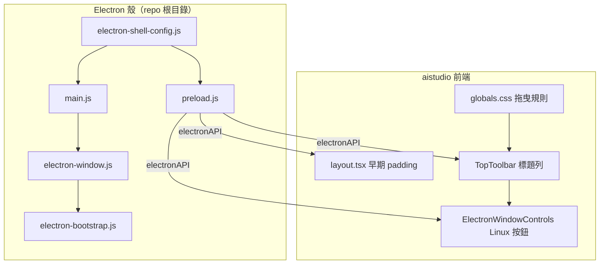

::: warning
本文是由AI生成，是在功能製作過程中時順便備份內容當作為來手動處理時參考用，我沒花心力為該頁手動校稿。
:::

我正在嘗試理解你修改的東西。
所以 @aistudio-elrc-maker/components/ElectronWindowControls.tsx 是直接由 aistudio-elrc-maker 由前端自己畫視窗三按鈕嗎？

然後我意外覺得 Electron效果意外的好，本來以為這種隱藏視窗外框之後，視窗陰影在Linux Wayland都會失效，結果本次測試有看到陰影？這是作業系統實現的？還是本專案自己硬做實現的？ （一堆Electron程式都沒有陰影）

我看你這次修改，有出現好幾份新檔案，可以大致解釋一下用途嗎？

***


你的理解方向是對的，下面用架構角度整理。

## `ElectronWindowControls.tsx` 是誰畫的？

**是，但只在 Linux 上。**

這個元件在 **aistudio 前端（React）** 裡畫三顆按鈕（最小化／最大化／關閉），並不是 Electron 原生 GTK 按鈕。

流程是：

```
使用者點按鈕
  → ElectronWindowControls（React）
  → window.electronAPI.windowMinimize / windowToggleMaximize / windowClose
  → preload.js（IPC）
  → main.js（BrowserWindow.minimize / maximize / close）
```

它掛在 `TopToolbar` 最右側，取代原本空的 `--titlebar-right-padding`  spacer。只有 `electronAPI.shell.useCustomWindowControls === true` 時才會顯示，也就是 **Linux**。

| 平台 | 按鈕來源 | 前端元件 |
|------|----------|----------|
| **macOS** | 系統紅綠燈（`hiddenInset`） | 不渲染 `ElectronWindowControls` |
| **Windows** | 系統 `titleBarOverlay` 覆蓋按鈕 | 不渲染，只留右側 padding |
| **Linux** | 前端自畫 | **會渲染** `ElectronWindowControls` |

所以：**Linux = 前端畫按鈕 + Electron 執行視窗操作**；macOS／Windows = 盡量用系統原生按鈕，前端只負責排版（padding、拖曳區）。

---

## 視窗陰影：系統做的，專案沒有硬做

本專案 **沒有** 自己做視窗外框陰影（沒有 `box-shadow` 包整個視窗、沒有透明視窗假陰影之類的）。

Linux 設定是：

```46:49:electron-shell-config.js
  return {
    ...base,
    frame: false,
  };
```

`frame: false` 只代表 **拿掉系統標題列／邊框**，不是「不要陰影」。視窗仍是正常的不透明 `BrowserWindow`（`backgroundColor: '#16191E'`），由 **Wayland 合成器**（KDE KWin、Mutter 等）依桌面主題畫陰影。

很多 Electron 程式在 Linux 上看不到陰影，常見原因包括：

- 視窗設成 **透明**（`transparent: true`）→ 合成器常不畫陰影  
- 某些 **client-side decoration** 實作不完整  
- 合成器／主題對「無裝飾視窗」處理不一致  

這次能看見陰影，比較像是 **你目前的桌面環境 + 我們用不透明無邊框視窗** 的結果，不是專案額外實作的特效。

---

## 新檔案大致分工

### 在 `aistudio-elrc-maker/`（可回補 AI Studio）

| 檔案 | 用途 |
|------|------|
| **`components/ElectronWindowControls.tsx`** | Linux 專用：React 畫三顆視窗按鈕，透過 `electronAPI` 呼叫主行程 |
| **`app/globals.css`**（增補） | `app-region-drag`、 `html.electron-shell header` 拖曳規則 |
| **`app/layout.tsx`**（增補） | 啟動時讀 `electronAPI.shell`，設 titlebar padding、`electron-shell` class |
| **`components/TopToolbar.tsx`**（增補） | 嵌入 `ElectronWindowControls`、標題列拖曳、雙擊最大化、Linux IPC 拖曳 |
| **`components/WebSystemIntegration.tsx`**（增補） | React 掛載後再設一次 padding（備援） |

### 在 repo 根目錄（Electron 殼，不進 submodule）

| 檔案 | 用途 |
|------|------|
| **`electron-shell-config.js`** | 各平台 `BrowserWindow` 選項 + `shell` 設定（padding、是否自畫按鈕） |
| **`electron-window.js`** | 讀取 `electron-shell.css` / `electron-bootstrap.js`，注入到網頁 |
| **`electron-shell.css`** | 少許 Electron 殼層樣式（早期 fixed 按鈕已拿掉，主樣式在 globals） |
| **`electron-bootstrap.js`** | 極短備援腳本：在 React 前設定 CSS 變數 |
| **`main.js`**（修改） | 建立視窗、IPC（最小化／最大化／關閉／拖曳）、Linux Wayland 開關 |
| **`preload.js`**（修改） | 暴露 `window.electronAPI` 給前端 |

### 關係一圖



---

## 設計取捨（為什麼這樣拆）

1. **靜態匯出**：build 時沒有 `electronAPI`，所以按鈕必須在 **client 掛載後** 才顯示，並用 `html.electron-shell` 在 CSS 處理拖曳。  
2. **平台混合**：能原生就原生（macOS／Windows），只有 Linux 必須前端自畫。  
3. **submodule 邊界**：核心 UI 在 aistudio；視窗建立與 IPC 留在 Electron 根目錄。

若你想把 `ElectronWindowControls` 改成只在 Electron 打包時才編譯進去（web 版完全不帶這支檔），也可以再討論一層 build flag，那是之後的優化，不是現在運作的必要條件。
